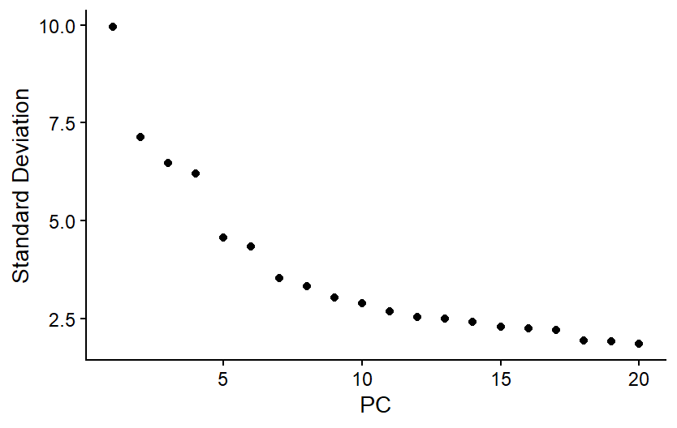
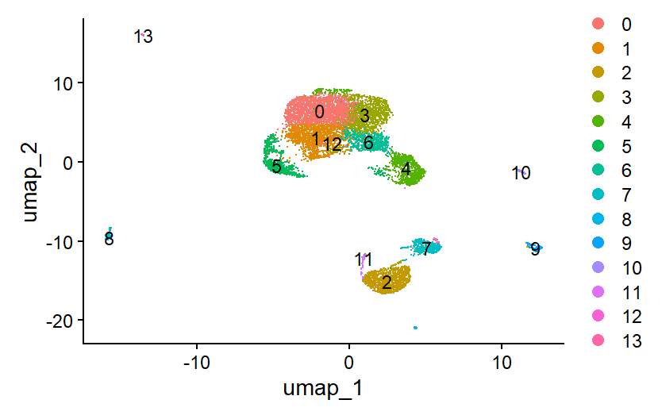
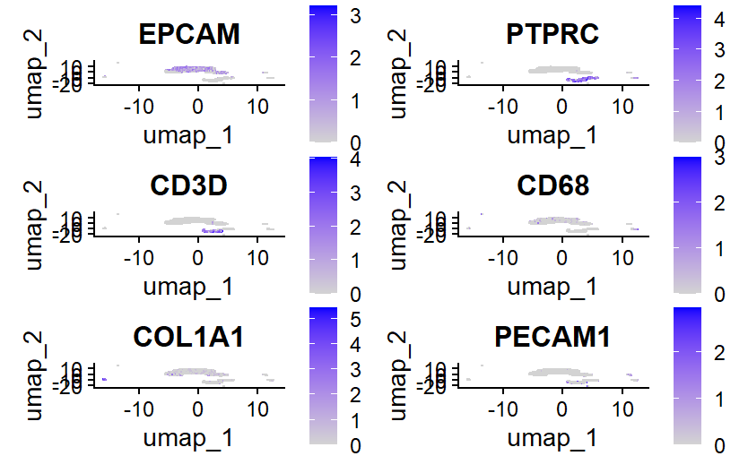
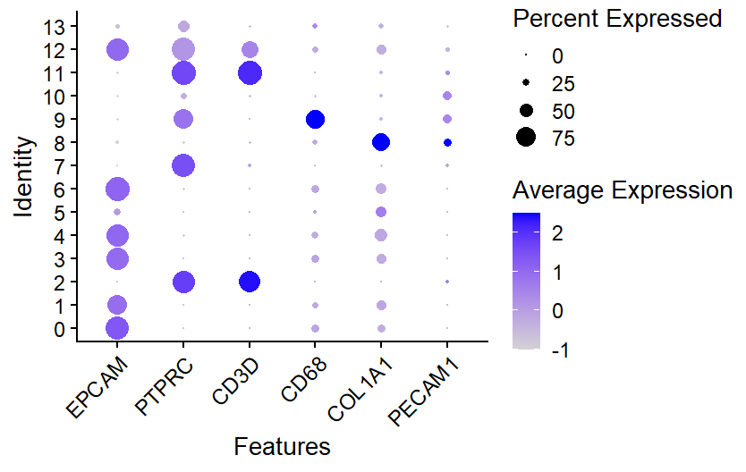
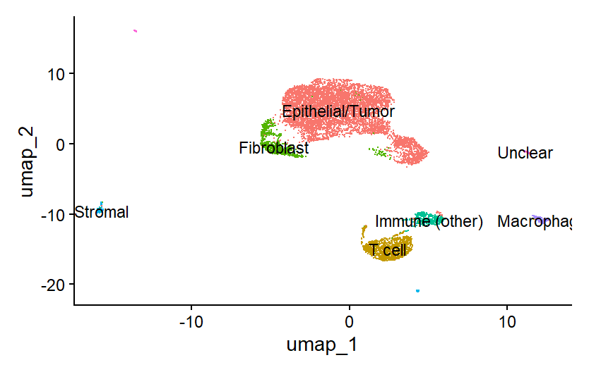
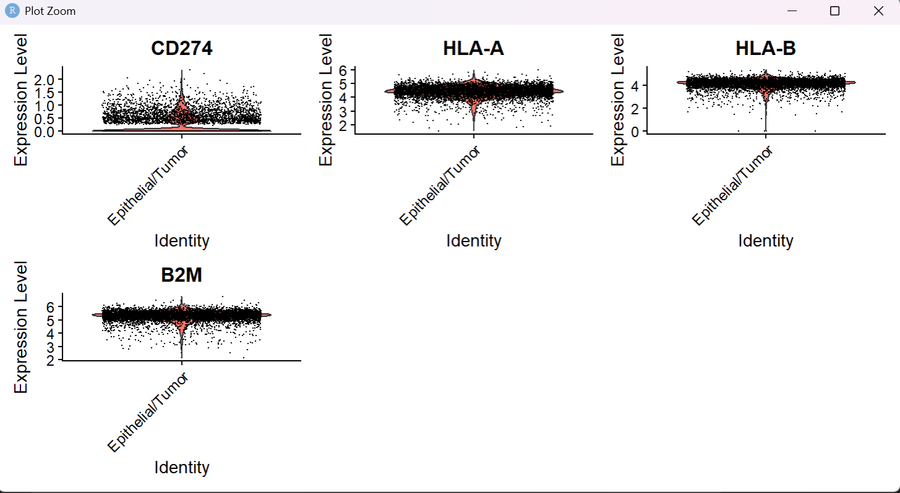
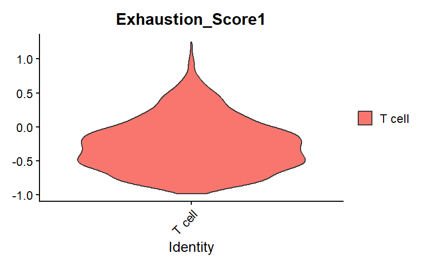
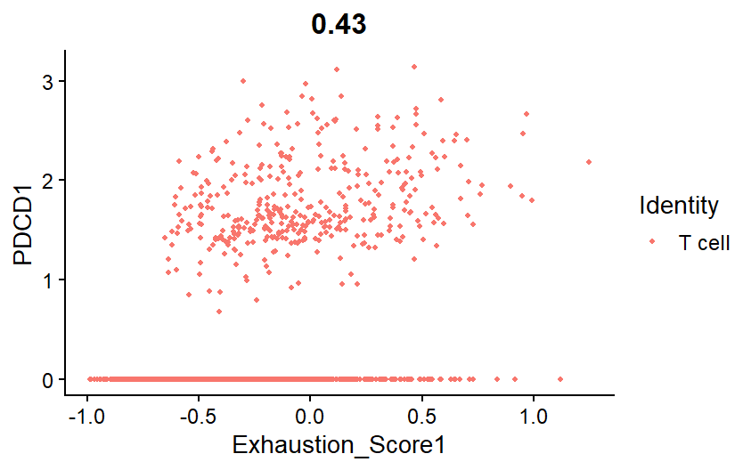

# Single-Cell RNA-Seq Analysis of Immune Escape Mechanisms in Cervical Cancer

**Tools:** R (4.5.2), Seurat (5.5.1) | **Dataset:** Public cervical tumor scRNA-seq sample (10x Genomics format, 11,818 cells)

Investigation of PD-1/PD-L1 checkpoint-mediated immune escape and T cell exhaustion in the cervical cancer tumor microenvironment.

---

## Overview

This project applies a complete single-cell RNA-seq pipeline to identify tumor and immune cell populations within a cervical cancer sample, then focuses on two connected immune escape mechanisms: **PD-L1 expression heterogeneity in tumor cells** and **T cell exhaustion**, evaluated alongside intact antigen presentation machinery.

---

## Step 1: Environment Setup

```r
install.packages("Seurat")
install.packages(c("dplyr", "ggplot2", "patchwork", "stringi"))

library(Seurat)
library(dplyr)
```

---

## Step 2: Load Raw Data

```r
counts <- ReadMtx(
  mtx = "sample1matrix.mtx.gz",
  cells = "sample1barcodes.tsv.gz",
  features = "sample1features.tsv.gz"
)

cervical_obj <- CreateSeuratObject(
  counts,
  project = "CervicalCC",
  min.cells = 3,       # genes detected in >= 3 cells
  min.features = 200   # cells with >= 200 genes detected
)

cervical_obj   # 23,930 genes x 11,818 cells
```

---

## Step 3: Quality Control

```r
cervical_obj[["percent.mt"]] <- PercentageFeatureSet(cervical_obj, pattern = "^MT-")
VlnPlot(cervical_obj, features = c("nFeature_RNA", "nCount_RNA", "percent.mt"), ncol = 3)
```

Thresholds were set by inspecting this sample's own distribution rather than reusing defaults:

```r
cervical_obj <- subset(
  cervical_obj,
  subset = nFeature_RNA > 500 & nFeature_RNA < 6000 & percent.mt < 20
)
```

---

## Step 4: Normalization and Feature Selection

```r
cervical_obj <- NormalizeData(cervical_obj)
cervical_obj <- FindVariableFeatures(cervical_obj, selection.method = "vst", nfeatures = 2000)
cervical_obj <- ScaleData(cervical_obj)
```

---

## Step 5: Dimensionality Reduction

```r
cervical_obj <- RunPCA(cervical_obj, features = VariableFeatures(cervical_obj))
ElbowPlot(cervical_obj)
```



*PCA standard deviation across the first 20 principal components. The gradual decline (rather than a sharp elbow) reflects the greater cellular heterogeneity of solid tumor tissue compared to blood. 15 PCs were retained for downstream clustering.*

---

## Step 6: Clustering and Visualization

```r
cervical_obj <- FindNeighbors(cervical_obj, dims = 1:15)
cervical_obj <- FindClusters(cervical_obj, resolution = 0.5)   # -> 14 clusters
cervical_obj <- RunUMAP(cervical_obj, dims = 1:15)
DimPlot(cervical_obj, reduction = "umap", label = TRUE)
```



*UMAP projection showing 14 unsupervised clusters (Louvain algorithm, resolution 0.5) prior to cell-type annotation. Clusters group into distinct spatial "islands," consistent with separate major cell lineages.*

---

## Step 7: Cell Type Annotation

```r
FeaturePlot(cervical_obj, features = c("EPCAM", "PTPRC", "CD3D", "CD68", "COL1A1", "PECAM1"))
```



*Expression of canonical lineage markers projected onto the UMAP.*

```r
DotPlot(cervical_obj, features = c("EPCAM", "PTPRC", "CD3D", "CD68", "COL1A1", "PECAM1")) + RotatedAxis()
```



*Expression of the same six lineage markers summarized by cluster. Dot size = percent of cells expressing the gene; color = average expression. This quantitative view was the primary evidence used to assign cluster identities.*

| Gene | Cell type flagged |
|---|---|
| EPCAM | Epithelial / tumor |
| PTPRC (CD45) | All immune cells |
| CD3D | T cells |
| CD68 | Macrophages |
| COL1A1 | Fibroblasts |
| PECAM1 (CD31) | Endothelial cells |

```r
new.labels <- c("Epithelial/Tumor", "Epithelial/Tumor", "T cell", "Epithelial/Tumor",
                "Epithelial/Tumor", "Fibroblast", "Epithelial/Tumor", "Immune (other)",
                "Stromal", "Macrophage", "Unclear", "T cell", "Epithelial/Tumor", "Unclear")
names(new.labels) <- levels(cervical_obj)
cervical_obj <- RenameIdents(cervical_obj, new.labels)
DimPlot(cervical_obj, label = TRUE) + NoLegend()
```



*Final annotated UMAP showing major cell populations: Epithelial/Tumor, T cell, Macrophage, Fibroblast, Stromal, and Immune (other). Two clusters remained unresolved.*

**Independent validation** (unbiased marker discovery, cross-checked against manual labels):

```r
cervical_obj.markers <- FindAllMarkers(cervical_obj, only.pos = TRUE, min.pct = 0.25, logfc.threshold = 0.25)
cervical_obj.markers %>% group_by(cluster) %>% slice_max(n = 3, order_by = avg_log2FC)
```

---

## Step 8: Subset Key Populations

```r
tcells     <- subset(cervical_obj, idents = "T cell")
epithelial <- subset(cervical_obj, idents = "Epithelial/Tumor")
```

---

## Step 9: Tumor-Intrinsic Escape Markers

```r
VlnPlot(epithelial, features = c("CD274", "HLA-A", "HLA-B", "B2M"), pt.size = 0)
```



*CD274 (PD-L1), HLA-A, HLA-B, and B2M expression in the Epithelial/Tumor cluster. HLA-A, HLA-B, and B2M were broadly and robustly expressed (antigen presentation intact). CD274 showed heterogeneous expression.*

```r
pdl1_any    <- sum(FetchData(epithelial, vars = "CD274")$CD274 > 0) / ncol(epithelial) * 100  # 42.6%
pdl1_robust <- sum(FetchData(epithelial, vars = "CD274")$CD274 > 1) / ncol(epithelial) * 100  # 5.75%
```

**Result:** 42.6% of tumor cells show any detectable CD274 (PD-L1); 5.75% (a subset of that group) show robust, high-confidence expression. HLA-A, HLA-B, B2M remain broadly and robustly expressed.

---

## Step 10: T Cell Exhaustion Analysis

```r
FeaturePlot(tcells, features = c("PDCD1", "LAG3", "HAVCR2", "CTLA4", "TOX", "ENTPD1"))

exhaustion_genes <- list(c("PDCD1", "LAG3", "HAVCR2", "CTLA4", "TOX", "ENTPD1"))
tcells <- AddModuleScore(tcells, features = exhaustion_genes, name = "Exhaustion_Score")

VlnPlot(tcells, features = "Exhaustion_Score1", pt.size = 0)
```



*Distribution of the composite exhaustion score across all T cells. Most cells cluster near baseline; a distinct minority subpopulation shows notably elevated scores, consistent with a genuine exhausted subset rather than a uniform shift.*

**Validate the score against PD-1 directly:**

```r
FeatureScatter(tcells, feature1 = "Exhaustion_Score1", feature2 = "PDCD1")
```



*Composite exhaustion score plotted against raw PDCD1 (PD-1) expression per T cell (r = 0.43, moderate positive correlation). Confirms the score captures real exhaustion-associated signal rather than noise.*

**Quantify PD-1 expression directly (separate calculation from the correlation above):**

```r
pd1_any    <- sum(FetchData(tcells, vars = "PDCD1")$PDCD1 > 0) / ncol(tcells) * 100  # 29.2%
pd1_robust <- sum(FetchData(tcells, vars = "PDCD1")$PDCD1 > 1) / ncol(tcells) * 100  # 28.5%
```

**Result:** 29.2% of T cells show detectable PDCD1; 28.5% show robust expression — a consistently strong signal when present, unlike the more variable PD-L1 pattern in tumor cells.

---

## Step 11: Save Progress

```r
save(cervical_obj, tcells, epithelial, file = "cervical_cancer_immune_escape_analysis.RData")
# Reload with: library(Seurat); load("cervical_cancer_immune_escape_analysis.RData")
```

---

## Summary of Key Results

| Metric | Value |
|---|---|
| Cells (post-QC) | ~11,000+ |
| Clusters identified | 14 |
| PCs used | 15 |
| CD274 (PD-L1)+ tumor cells (any / robust) | 42.6% / 5.75% |
| HLA-A/B, B2M in tumor cells | Broad, robust (intact) |
| PDCD1 (PD-1)+ T cells (any / robust) | 29.2% / 28.5% |
| Exhaustion score vs. PDCD1 correlation | r = 0.43 |

---

## Conclusion

A defined subset of tumor cells express PD-L1 (a small strongly-expressing core within a wider low-level-expressing population), while a substantial, consistently robust fraction of tumor-infiltrating T cells express PD-1 and show elevated exhaustion scores. Antigen presentation machinery (HLA-A/B, B2M) remains largely intact. This pattern is consistent with **active PD-1/PD-L1-mediated immune checkpoint escape**, rather than escape via loss of antigen presentation.

---

## Limitations

- Single tumor sample, no biological replicates — findings are descriptive/exploratory, not statistically confirmatory
- No formal differential expression testing (adjusted p-values) applied
- Ligand-receptor communication inference (e.g., CellChat) not yet completed
- Two small clusters remained unresolved/unannotated
- Findings reproduce, rather than extend, results already reported in the source publication for this dataset

## Next Steps

- Extend to paired normal tissue for direct tumor-vs-normal statistical comparison
- Apply formal differential expression testing between tumor and normal
- Complete ligand-receptor inference (CellChat) to formally test PD-L1 → PD-1 signaling
- Sub-cluster T cells into CD4/CD8/exhaustion-state subtypes
